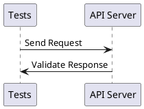

# API Testing

API Testing in general can greatly improve the efficiency of our testing strategy helping us to deliver software faster than ever. It has many aspects but generally consists of making a request & validating the response.



> **pactum** is packed with a rich set of features to make a request & validate the server response.

- [Request Making](request-making)
- [Response Validation](response-validation)

Depending upon lot of factors, API testing requires a lot of ingredients to test the functionality of an application. This library provides all the necessary ingredients that help us to write better API automation tests in an easy, fast & fun way.

## Test Runners

!> As said earlier in the [Quick Start](quick-start) guide, **pactum** is not a test runner. It needs to be used alongside with a test runner like **mocha**, **jest**, **jasmine** or **cucumber**.

We can integrate **pactum** with any of the test runners that support *promises* like [mocha](https://www.npmjs.com/package/mocha), [jest](https://www.npmjs.com/package/jest), [jasmine](https://www.npmjs.com/package/jasmine), [ava](https://www.npmjs.com/package/ava), [uvu](https://www.npmjs.com/package/uvu), [tap](https://www.npmjs.com/package/tap) or [cucumber](https://www.npmjs.com/package/@cucumber). Or build your own if your heart desires, **pactum** should work out of the box.

The whole documentation will be using **mocha** as the test runner. **Cucumber** is a popular choice among organizations, see [pactum-cucumber-boilerplate](https://github.com/pactumjs/pactum-cucumber-boilerplate) for a working example.
  
> Before starting with **pactum**, get familiar with any of the above test runners. It will help us to write more readable & maintainable tests. 

## Testing Style

Tests in **pactum** are clear and comprehensive. It uses numerous descriptive methods to build your requests and expectations.

Tests can be written in two styles

* Chaining the request & expectations
* Breaking the request & expectations (BDD Style)

<!-- tabs:start -->

#### ** Chaining **

We can build the request & expectations by chaining the descriptive methods offered by this library.

```js
const pactum = require('pactum');

it('should have a user with name bolt', async () => {
  await pactum.spec()
    .get('http://localhost:9393/api/users')
    .withQueryParams('name', 'bolt')
    .expectStatus(200)
    .expectJson({
      "id": 1,
      "name": "bolt",
      "createdAt": "2020-08-19T14:26:44.169Z"
    })
    .expectJsonSchema({
      type: 'object',
      properties: {
        id: {
          type: 'number'
        }
      }
    })
    .expectResponseTime(100);
});
```

#### ** Breaking **

When you want to make your tests much more clearer, you can break your spec into multiple steps. This will come into handy when integrating **pactum** with **cucumber**. See [pactum-cucumber-boilerplate](https://github.com/pactumjs/pactum-cucumber-boilerplate) for more details on pactum & cucumber integration.


Use `pactum.spec()` to get an instance of the spec. With **spec** you can build your request & expectations in multiple steps.

Once the request is built, perform the request by calling `.toss()` method and wait for the promise to resolve.

**Assertions should be made after the request is performed & resolved**.

Assertions should be made by either using 

- `pactum.expect` - Doesn't keep a track of test case status. *(Not Recommended)*
- `spec.response()` - prints request & response in terminal if the test case fails & keeps a track of the test case status. *(Recommended)*

Reporting with this testing style differs. Learn more about it at [reporting](reporting)

```js
const pactum = require('pactum');
const expect = pactum.expect;

describe('should have a user with name bolt', () => {

  let spec = pactum.spec();
  let response;

  it('given a user is requested', () => {
    spec.get('http://localhost:9393/api/users');
  });

  it('with name bolt', () => {
    spec.withQueryParams('name', 'bolt');
  });

  it('should return a response', async () => {
    response = await spec.toss();
  });

  it('should return a status 200', () => {
    expect(response).to.have.status(200);
  });

  it('should return a valid user', async () => {
    spec.response().to.have.jsonLike({ name: 'snow'});
  });

  it('should return a valid user schema', async () => {
    expect(response).to.have.jsonSchema({ type: 'object'});
  });

  it('should return response within 100 milliseconds', async () => {
    spec.response().to.have.responseTimeLessThan(100);
  });

});
```

<!-- tabs:end -->

----

<a href="#/quick-start" >
  
</a>
<a href="#/request-making" >
  
</a>