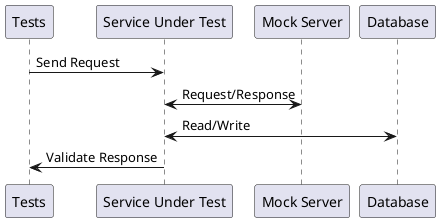
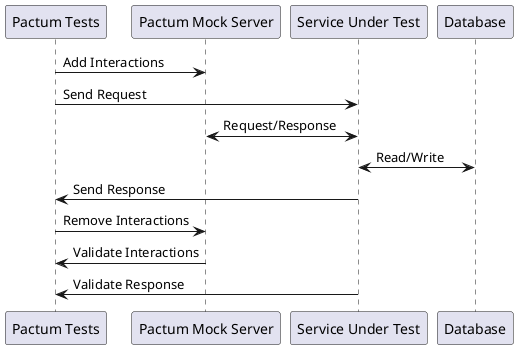

# Component Testing

Component testing is defined as a software testing type, in which the testing is performed on each component (*or service*) separately without integrating with other components (*or services*).

These tests are all about testing the functionality of individual service. During this, your service will be talking to other external services. But instead of talking to real external services, they talk to mock versions of external services.

It involves testing a service in isolation by 

- If required, running a mock server locally
- If required, running a database locally
- Start the "Service Under Test" by updating the configuration to use local mock server & database.

> [Docker](https://www.docker.com) is great place to test your applications in isolation 



### Pre Requisite

* [API Testing](api-testing)
* [Integration Testing](integration-testing)
* [Mock Server](mock-server)

## Example

To better understand the concept of component testing, consider an e-commerce application that has multiple micro-services like **login-service**, **payment-service**, **order-service**, **inventory-service** and many more. All these micro-services are developed, deployed & operated independently by different teams.

Lets focus on **order-service** which is responsible for managing orders. When a user places an order, **order-service** will receive the order request & process it. During the processing of order it will internally communicates with the **inventory-service** to check if the product is available or not. 

We can write two simple functional tests for **order-service**

- Buy a product which is in-stock
- Buy a product which is out-of-stock

Consider **order-service** is running on port `3000` locally & it has an API endpoint `/api/orders` that accepts a POST request with the following JSON with product details for placing an order.

```json
{
  "Name": "iPhone X",
  "Quantity": 2
}
```

*inventory-service* exposes an API endpoint `/api/inventory` that returns available products in the inventory. When requested, it will return the product availability details in the form of following JSON

```json
{
  "InStock": true
}
```

When user places an order, **order-service** will make a GET request to `/api/inventory?product=iPhone`. Based on the response from the **inventory-service**, it will accept or reject an order.

Assume we have a mock server that returns a successful response for product - *iPhone* & unsuccessful response for product - *Galaxy*.

If the mock server is written in **express**, the internal code for mock server will look something like this

```js
const app = require('express')();

app.get('/api/inventory', (req, res) => {
  if (req.query.product === 'iPhone') {
    res.send({ InStock = true });
  } else {
    res.send({ InStock = false });
  }
});

app.listen(4000, () => {});
```

Lets look at the component tests.

```js
it('should buy a product which is in stock', async () => {
  await pactum.spec()
    .post('http://localhost:3000/api/orders')
    .withJson({
      "name": "iPhone",
      "quantity": 1
    })
    .expectStatus(200);
});

it('should not buy a product which is out-of-stock', async () => {
  await pactum.spec()
    .post('http://localhost:3000/api/orders')
    .withJson({
      "name": "Galaxy",
      "quantity": 1
    })
    .expectStatus(400)
    .expectJson({
      "message": "product is out-of-stock"
    });
});
```

This looks simple & easy to test. But as the functionality of the application grows, the dependency of the **order-service** on other services will increase. To test different scenarios, it becomes difficult to control the behavior of mock server.

# Component Testing Pattern

**pactum** makes component testing easy & fun as it allows us to control the behavior of the mock server for each & every test case. It works on top of [API Testing](api-testing) & [Mock Server](mock-server). If you haven't read about them, use the above links to learn more about them.

Instead of maintaining a separate mock server, pactum comes with it. Interactions can be added to the mock server before the execution of a test case through `useInteraction` method. Once the interactions are added, you can build your request & expectations on top of it.

## Workflow

1. "Test" will add required Interactions to the Mock Server
2. "Test" will send Request To "Service Under Test"
3. "Service Under Test" will make a request to "Mock Server"
4. If the received request matches with the interaction, specified response will be returned by "Mock Server".
5. "Service Under Test" will do whatever it needs to do & send a response back to the tests.
6. "Test" will remove the interaction from the mock serve.
7. "Test" will check if the interactions are exercised or not.
8. "Test" will validate the response.

For the next test case, the mock server will be empty. This gives us an unique opportunity to test the service by controlling the external dependencies for each & every test case.



## Simple Component Tests

* Interactions added through `useInteraction` method are auto removed from the mock server.
* If interactions added through `useInteraction` method are not exercised, *pactum* will immediately fail the test case.

<!-- tabs:start -->

#### ** base.spec.js **

```js
const { mock } = require('pactum');

// global hooks
before(async () => {
  await mock.start(4000);
});

after(async () => {
  await mock.stop();
});
```

#### ** orders.spec.js **

```js
const pactum = require('pactum');

it('should buy a product which is in stock', async () => {
  await pactum.spec()
    .useInteraction({
      request: {
        method: 'GET',
        path: '/api/inventory',
        queryParams: {
          product: 'iPhone'
        }
      },
      response: {
        status: 200,
        body: {
          "InStock": true
        }
      }
    })
    .post('/api/orders')
    .withJson({
      "name": "iPhone",
      "quantity": 1
    })
    .expectStatus(200);
});

it('should not buy a product which is out-of-stock', async () => {
  await pactum.spec()
    .useInteraction({
      request: {
        method: 'GET',
        path: '/api/inventory',
        queryParams: {
          product: 'iPhone'
        }
      },
      response: {
        status: 200,
        body: {
          "InStock": false
        }
      }
    })
    .post('/api/orders')
    .withJson({
      "name": "iPhone",
      "quantity": 1
    })
    .expectStatus(400)
    .expectJson({
      "message": "product is out-of-stock"
    });
});
```

<!-- tabs:end -->

## Interactions with Expectations

There are cases you want a particular interaction should not be exercised or you want a particular interaction to be called multiple times.

We can add expectations using `expects` property.

```js
it('should not get product details', async () => {
  await pactum.spec()
    .useInteraction({
      request: {
        method: 'GET',
        path: '/api/product'
      },
      response: {
        status: 200
      },
      expects: {
        exercised: false,
        callCount: 0
      }
    })
    .get('/api/orders/123-invalid')
    .expectStatus(400);
});
```

In case the Interaction expects needs to be skipped for a special use case, it can be achieved by adding an optional `disable` flag in the `expects`.
```js
it('should get user details', async () => {
  await pactum.spec()
    .useInteraction([{
      request: {
        method: 'GET',
        path: '/api/project'
      },
      response: {
        status: 200
      },
      expects: {
        disable: true,  // default value is false
        exercised: true,
        callCount: 1
      }
    },
    {
      request: {
        method: 'GET',
        path: '/api/users'
      },
      response: {
        status: 200      
      },
    }])
    .get('http://localhost:9393/api/users/1')
    .expectStatus(200)
});
```
In the above example, the first interation in the array will not be exercised in this test and it will result in `Interaction not exercised` error. Adding the `disable` flag in `expects` of first Interation will skip the check.

!> For more details on Interaction options, check [Interaction Options](mock-server?id=interaction-options)

## Multiple Interactions

In real-life scenarios, a single service might be dependent upon *"n"* number of services. You can use `useInteraction` method multiple times to add multiple interactions.

* All the interactions are auto removed.
* Test will fail, if any one of the interaction is not exercised.

```js
it('should not buy a product which is out-of-stock', async () => {
  await pactum.spec()
    .useInteraction(/* one interaction details */)
    .useInteraction(/* another interaction details */)
    .post('/api/orders')
    .withJson({
      "name": "iPhone",
      "quantity": 1
    })
    .expectStatus(400)
    .expectJson({
      "message": "product is out-of-stock"
    });
});
```

## Interaction Handlers

There are high chances that you wanted to use the same interaction in multiple occasions. To reuse interactions, you can create separate *js* files to hold interactions & import them in your spec file. This is one way to solve the issue. But there is a better way through *interaction handlers*.

Learn more about interaction handlers [here](mock-server?id=handlers)

Interaction handlers help us to reuse interactions across tests. Use `handler.addInteractionHandler` function to temporarily store an interaction & later use it in test cases.

It accepts two arguments

* handler name - a string to refer the interaction later
* callback function - it should return a mock interaction

While using a mock handler, you can pass custom data into it to change the behavior of the interaction. Look at the below example where we use the same interaction in both scenarios.

<!-- tabs:start -->

#### ** handlers.js **

```js
const { addInteractionHandler } = require('pactum').handler;

addInteractionHandler('get product', (ctx) => {
  return {
    request: {
      method: 'GET',
      path: '/api/inventory',
      queryParams: {
        product: ctx.data.product
      }
    },
    response: {
      status: 200,
      body: {
        "InStock": ctx.data.inStock
      }
    }
  }    
});
```

#### ** base.spec.js **

```js
const { mock } = require('pactum');

// load handlers
require('./handlers');

// global hooks
before(async () => {
  await mock.start(4000);
});

after(async () => {
  await mock.stop();
});
```

#### ** orders.spec.js **

```js
const pactum = require('pactum');

it('should buy a product which is in stock', async () => {
  await pactum.spec()
    .useInteraction('get product', { product: 'iPhone', inStock: true })
    .post('/api/orders')
    .withJson({
      "name": "iPhone",
      "quantity": 1
    })
    .expectStatus(200);
});

it('should not buy a product which is out-of-stock', async () => {
  await pactum.spec()
    .useInteraction('get product', { product: 'iPhone', inStock: false })
    .post('/api/orders')
    .withJson({
      "name": "iPhone",
      "quantity": 1
    })
    .expectStatus(400)
    .expectJson({
      "message": "product is out-of-stock"
    });
});
```

<!-- tabs:end -->

## Non CRUD Endpoints

Not all endpoints will perform CRUD operations. Some endpoints will perform some long running operations in the background even though it sends a response immediately. It becomes difficult to test how it interacts with other services in the background.

This library helps to validate whether interactions are exercised or not in the background. We can also validate the number of times the interaction is exercised.

Use `mock.addInteraction` to add a interaction to the server & later use `mock.getInteraction` to get interaction details & perform validations on it.

Lets look at an example

```js
it('some background process', async () => {
  const id = mock.addInteraction('get product');
  await pactum.spec()
    .post('/api/process')
    .expectStatus(202);
  // wait for the process to complete
  await pactum.sleep(3000);
  const interaction = mock.getInteraction(id);
  expect(interaction.exercised).equals(true);
  expect(interaction.callCount).equals(1);
  mock.removeInteraction(id);
});
```

### Static Wait

Alternatively, use `wait` method to pause the validation for the background process to complete.

```js
it('some background process', async () => {
  await pactum.spec()
    .useInteraction('get product')
    .post('/api/process')
    .expectStatus(202)
    .wait(1000);
    // it waits for 1s after receiving the response
});
```

### Dynamic Wait

`wait` method also accepts a `spec` instance with a retry mechanism to dynamically wait for something.

```js
it('some background process', async () => {
  // don't use 'await' statement
  const specWait = pactum.spec()
    .get('/api/status')
    .retry({ strategy: ({res}) => res.json.status === 'completed' });
  await pactum.spec()
    .useInteraction('get product')
    .post('/api/process')
    .expectStatus(202)
    .wait(specWait);
});
```

#### Background Interactions

For Non-CRUD endpoints, your service could be taking to other dependent services after replying with a response. This behavior is mostly seen in asynchronous tasks. For such test cases, add a background interaction and invoke the `wait` method.

By default when a background interaction is present, pactum will wait for `1000` milliseconds with a polling interval of `100` milliseconds to check the background interactions are exercised or not.

Imagine it as an Explicit Wait in Selenium.

```js
it('some background process', async () => {
  await pactum.spec()
    .useInteraction({
      background: true,
      request: {
        method: 'GET',
        path: '/api/products'
      },
      response: {
        status: 200,
        body: []
      }
    })
    .post('/api/process')
    .expectStatus(202)
    .wait();
});
```

We are allowed to override the default behavior.

```js
it('some background process', async () => {
  await pactum.spec()
    .useInteraction('some background interaction')
    .post('/api/process')
    .expectStatus(202)
    .wait(2000, 500); // wait for 2000 ms with a polling interval of 500 ms
});
```

#### Wait Handlers

Wait handlers are custom functions that helps us to wait for background tasks to complete before moving to the next test case or API call.

Check more information [here](https://pactumjs.github.io/#/api-handlers?id=addwaithandler)

## Using Remote Mock Server

For some reasons, you want the mock server to be independent of component tests & you still want the ability to control it remotely while running your api tests. This can be achieved through `mock.useRemoteServer` function. While using remote server, all the existing functions will return promises.

Let's look at the below example, where we start the mock server independent of component tests.

```js
// server.js
const pactum = require('pactum');
const mock = pactum.mock;
const handler = pactum.handler;

handler.addInteractionHandler('get product', (ctx) => {
  return {
    request: {
      method: 'GET',
      path: '/api/inventory',
      queryParams: {
        product: ctx.data.product
      }
    },
    response: {
      status: 200,
      body: {
        "InStock": ctx.data.inStock
      }
    }    
  }    
});

mock.start(4000);
```

Everything works as usual when adding interactions through `useInteraction` method. But methods from *mock* will return promises. 

```js
// test.js
const pactum = require('pactum');
const mock = pactum.mock;

before(() => {
  mock.useRemoteServer('http://localhost:4000');
});

it('should buy a product which is in stock', async () => {
  await pactum.spec()
    .useInteraction('get product', { product: 'iPhone', inStock: true })
    .post('/api/orders')
    .withJson({
      "name": "iPhone",
      "quantity": 1
    })
    .expectStatus(200);
});

it('should not buy a product which is out-of-stock', async () => {
  await pactum.spec()
    .useInteraction('get product', { product: 'iPhone', inStock: false })
    .post('/api/orders')
    .withJson({
      "name": "iPhone",
      "quantity": 1
    })
    .expectStatus(400)
    .expectJson({
      "message": "product is out-of-stock"
    });
});

it('some background process', async () => {
  const id = await mock.addInteraction('get product');
  await pactum.spec()
    .post('/api/process')
    .expectStatus(202);
  // wait for the process to complete
  const interaction = await mock.getInteraction(id);
  expect(interaction.exercised).equals(true);
  expect(interaction.callCount).equals(1);
  await mock.removeInteraction(id);
});
```

## Next

----

<a href="#/mock-server" >
  
</a>
<a href="#/contract-testing" >
  
</a>
