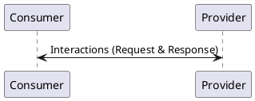
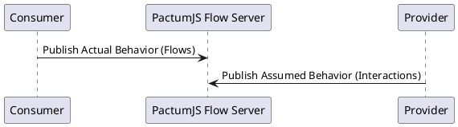
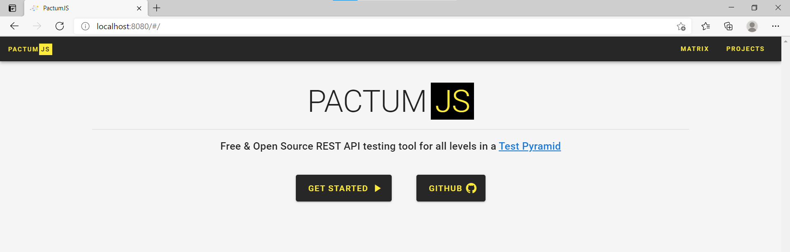

# Contract Testing

Contract testing is a methodology for ensuring that two separate systems (such as two microservices) are compatible with one other. It captures the interactions that are exchanged between each service, storing them in a contract, which can then be used to verify that both parties adhere to it.



<!-- In a world of micro-services architecture, there will be numerous micro-services that are developed, deployed & operated by different teams. One way to make sure all these moving parts work together is through having slow, brittle & expensive e2e or integration tests. But there is an another way to test the integrations between micro-services using contract tests which are fast, easy & cheap. 

Contract Testing is a technique for testing interactions between applications (often called as services) that communicate with each other, to ensure the messages they send or receive conform to a shared understanding that is documented in a **contract**.

Contract Testing gives a way for services to enter into an agreement on how they are going to communicate with each other. Once the agreement is in place it provides a way to modify the agreement but before the change takes effect, the services need to sign off on the new contract. -->

Learn more about contract testing at [pact.io](https://docs.pact.io)

> Pactum is inspired from **pact.io**.

## Terminology

* **Consumer** - An application that makes use of the functionality or data from another application to do its job.

* **Provider** - An application (often called a service) that provides functionality or data for other applications to use, often via an API.

<!-- * **Contract** - A contract is a documented form of shared understanding between a consumer & a provider. Pact creates this document in the form of a **JSON** file.

* **Pact** - A contract between a consumer and provider is called a pact. Each pact is a collection of interactions. -->

* **Interaction** - An individual message that combines a request sent by the consumer & minimal expected response replied by the provider.

* **Minimal Expected Response** - It describes the parts of the response the consumer wants the provider to return.

## Workflow

Different tools follow different patterns for contract testing. Pact and Spring Cloud Contracts are examples of **Consumer-Driven Contract Testing** pattern.

Pactum follows a different approach for contract testing. Pactum is a mix of **consumer-driven** & **provider-driven** contract testing. It converts all our existing *unit tests* or *component tests* that are written using this library into *contract tests*.

Contract Testing with pactum has two steps

1. Publish Actual Behavior (*By Provider*)
2. Publish Assumed Behavior (*From Consumer*)

Once we publish the actual & assumed behavior to **PactumJS Flow Server**, pactum will compare this behaviors and produce compatibility results.



Flows & Interactions are published to PactumJS Flow Server using [pactum-flow-plugin](https://www.npmjs.com/package/pactum-flow-plugin). Learn more about reporters [here](api-reporting).

## Pactum Flow Server

Before starting with contract testing, we need to set up the **pactumjs-flow-server** to save the assumed & actual behavior in a centralized location. Find official docker image of **pactumjs-flow-server** at https://hub.docker.com/r/asaianudeep/pactumjs. Follow the instructions to set it up.

Open your browser & navigate to [http://localhost:8080](http://localhost:8080). You should be able to find the below page.



### Actual Behavior

Actual behavior is recorded during component tests that are executed in providers pipeline. Each actual behavior is recorded as a **flow**. All these flows are published to **pactumjs-flow-server** using [pactum-flow-plugin](https://www.npmjs.com/package/pactum-flow-plugin).

- Convert an existing component test to contract test, use `pactum.flow()` in the place of `pactum.spec()`.
- Provide a unique name for each flow.
- Add pactum-flow-plugin reporter.

Tests for **inventory-service**.

<!-- tabs:start -->

#### ** inventory.spec.js **

```js
const pactum = require('pactum');

it('get a product in-stock from inventory-service', async () => {
  await pactum.flow('get a product in-stock')
    .get('/api/inventory-service/products')
    .withQueryParams('product', 'iPhone')
    .expectJson({
      "InStock": true
    })
    .expectStatus(200);
});
```

#### ** base.spec.js **

```js
const { reporter } = require('pactum');
const pf = require('pactum-flow-plugin');

function addFlowReporter() {
  pf.config.url = 'http://localhost:8080'; // pactum flow server url
  pf.config.projectId = 'team2_inventory-service';
  pf.config.projectName = '[TEAM2] Inventory-Service';
  pf.config.version = '1.0.18';
  pf.config.token = 'YWRtaW46YWRtaW4=';
  reporter.add(pf.reporter);
}

// global before
before(async () => {
  addFlowReporter();
});

// global after
after(async () => {
  await reporter.end();
});
```

<!-- tabs:end -->

Once you run the tests, actual behavior is published to **pactumjs-flow-server**. Click on `PROJECTS` to see the newly added project.


Click on the project to see more details about it.


### Assumed Behavior

Assumed behavior is recorded during unit tests or component tests that are executed in consumers pipeline. Each assumed behavior is recorded as an **interaction**. All these interactions are published to **PactumJS Flow Server** using [pactum-flow-plugin](https://www.npmjs.com/package/pactum-flow-plugin).

- Use interactions in your component tests or unit tests.
- Specify the provider id & flow name in the interactions.
- Add pactum-flow-plugin reporter.

Tests for **order-service** which depends upon **inventory-service** to accept orders.

<!-- tabs:start -->

#### ** orders.spec.js **

```js
const pactum = require('pactum');

it('post an orders to order-service', async () => {
  await pactum.flow('post an order')
    .useInteraction('get a product in-stock from inventory-service')
    .post('/api/order-service/orders')
    .withJson({
      'product': 'iPhone',
      'quantity': 1
    })
    .expectStatus(200);
});
```

#### ** handlers.js **

```js
const { addInteractionHandler } = require('pactum').handler;

addInteractionHandler('get a product in-stock from inventory-service', () => {
  return {
    provider: 'team2_inventory-service', // same as above project
    flow: 'get a product in-stock', // same as above flow
    request: {
      method: 'GET',
      path: '/api/inventory-service/products',
      queryParams: {
        product: 'iPhone'
      }
    },
    response: {
      status: 200,
      body: {
        "InStock": true
      }
    }
  }    
});
```

#### ** base.spec.js **

```js
const { reporter } = require('pactum');
const pf = require('pactum-flow-plugin');

require('./handlers'); // load handlers

function addFlowReporter() {
  pf.config.url = 'http://localhost:8080'; // pactum flow server url
  pf.config.projectId = 'team1_order-service';
  pf.config.projectName = '[TEAM1] Order-Service';
  pf.config.version = '2.1.16';
  pf.config.token = 'YWRtaW46YWRtaW4=';
  reporter.add(pf.reporter);
}

before(async () => {
  addFlowReporter();
  await mock.start(4000);
});

after(async () => {
  await mock.stop();
  await reporter.end();
});
```

<!-- tabs:end -->

Once you run the tests, assumed behavior is published to **pactumjs-flow-server**. Click on the project to see more details about it.


Click on the interactions to compare actual behavior & assumed behavior.


## API

To access the backend API (swagger page), navigate to [http://localhost:8080/api/flow/v1/](http://localhost:8080/api/flow/v1/). It has APIs for managing

- Projects
- Environments
- Quality Gates
- Compatibility Results

!> Contract Testing is still in experimental phase.