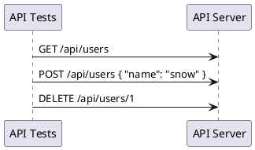

# Request Making

In general, the first step in API testing is to make a request to the server. There are different methods available in **PactumJS** that allows us to make a request.

- `pactum.spec()` - General API Testing
- `pactum.flow()` - Component & Contract API Testing
- `pactum.fuzz()` - Fuzz API Testing
- `pactum.e2e()` - E2E API Testing

?> `pactum.spec()` forms the base for all the above methods. So we will learn about `spec` method first and later about the rest of them.



### spec

`pactum.spec()` will return an instance of *spec* which can be used to build the request and expectations.

!> A spec can only make a single API request. To make multiple requests, we need to invoke `pactum.spec()` multiple times.

<!-- tabs:start -->

### ** Mocha **

```js
const pactum = require('pactum');

it('get 200 status from http-bin', async () => {
  await pactum.spec()
    .get('http://httpbin.org/status/200')
    .expectStatus(200);
});
```

### ** Cucumber **

```gherkin
Scenario: Check Status
  Given I make a GET request to "http://httpbin.org/status/200"
  When I receive a response
  Then response should have a status 200
```

```js
const pactum = require('pactum');
const { Given, When, Then, Before, After } = require('@cucumber/cucumber');

let spec = pactum.spec();

Before(() => {
  spec = pactum.spec();
});

Given(/^I make a (.*) request to (.*)$/, function (method, endpoint) {
  spec.withMethod(method);
  spec.withPath(endpoint);
});

When('I receive a response', async function () {
  await spec.toss();
});

Then('I expect response should have a status {int}', function (code) {
  spec.response().should.have.status(code);
});
```

<!-- tabs:end -->


To pass additional parameters to the request, we can chain or use the following methods individually to build our request.

| Method                    | Description                               |
| ------------------------- | ----------------------------------------- |
| `withMethod`              | request method                            |
| `withPath`                | request path                              |
| `withPathParams`          | request path parameters                   |
| `withQueryParams`         | request query parameters                  |
| `withHeaders`             | request headers                           |
| `withCookies`             | request cookies                           |
| `withBody`                | request body                              |
| `withJson`                | request json object                       |
| `withGraphQLQuery`        | graphQL query                             |
| `withGraphQLVariables`    | graphQL variables                         |
| `withFile`                | file path                                 |
| `withForm`                | object to send as form data               |
| `withMultiPartFormData`   | object to send as multi part form data    |
| `withRequestTimeout`      | sets request timeout                      |
| `withCore`                | http request options                      |
| `withAuth`                | basic auth details                        |
| `withFollowRedirects`     | sets follow redirect boolean property     |
| `inspect`                 | prints request & response details         |
| `retry`                   | retry on failures                         |
| `wait`                    | wait for non CRUD operations              |
| `useLogLevel`             | sets log level for troubleshooting        |
| `toss` (optional)         | runs the spec & returns a promise         |

## Request Methods

The request method indicates the method to be performed on the resource identified by the given Request-URI.

```js
await pactum.spec().get('http://domain.com/user');
await pactum.spec().post('http://domain.com/user');
await pactum.spec().put('http://domain.com/user');
await pactum.spec().patch('http://domain.com/user');
await pactum.spec().delete('http://domain.com/user');
```

In general, we set the base url to a constant value and just mention the HTTP path in test cases. See [Request Settings](request-making?id=request-settings) to learn more about default configuration.

<!-- tabs:start -->

### ** base.test.js **

```js
const { request } = require('pactum');

// global hook
before(() => {
  request.setBaseUrl('http://localhost:3000');
});
```

### ** projects.test.js **

```js
const pactum = require('pactum');

it('get projects', async () => {
  // request will be sent to http://localhost:3000/api/projects
  await pactum.spec()
    .get('/api/projects');
});
```

<!-- tabs:end -->

### Non CRUD Methods

Apart from the built-in request methods available in pactum, we can also pass custom HTTP methods and paths using `withMethod` and `withPath` functions.

```js
await pactum.spec()
  .withMethod('GET')
  .withPath('http://httpbin.org/status/200')
  .expectStatus(200);
```

## Path Params

Use `withPathParams` to pass path parameters to the request. We can either pass key-value pair or object as an argument. The given path params are replaced in the request path that are represented inside flower braces - `/some/api/{<key>}/path`.

```js
await pactum.spec()
  .get('/api/project/{project}/repo/{repo}')  // dynamic url
  .withPathParams('project', 'project-name')  // key-value pair
  .withPathParams({
    'repo': 'repo-name'                       // object
  })
  .expectStatus(200);

//  The above would result in a url like - /api/project/project-name/repo/repo-name
```

## Query Params

Use `withQueryParams` to pass query parameters to the request. We can either pass key-value pair or object as an argument.

```js
await pactum.spec()
  .get('https://randomuser.me/api')
  .withQueryParams('gender', 'male')    // key-value pair
  .withQueryParams({
    'country': 'IND',                   // object
    'age': 17
  })
  .expectStatus(200);

//  The above would result in a url like - https://randomuser.me/api?gender=male&country=IND&age=17
```

Passing an array of values would result in comma separated values.

```js
await pactum.spec()
  .get('https://some.me/api/users')
  .withQueryParams('id', [1, 2, 3])
  .expectStatus(200);

//  The above would result in a url like - https://some.me/api/users?id=1,2,3
```

## Headers

Use `withHeaders` to pass headers to the request. We can either pass key-value pair or object as an argument.

```js
await pactum.spec()
  .get('https://jsonplaceholder.typicode.com/comments')
  .withHeaders('Authorization', 'Basic abc')
  .withHeaders({
    'Content-Type': 'application/json'
  })
  .expectStatus(200);
```

In general, we set default headers to all the requests that are sent during API Testing. For example, authorization headers.

<!-- tabs:start -->

#### ** base.test.js **

```js
const { request } = require('pactum');

// global hook
before(() => {
  request.setBaseUrl('http://localhost:3000');
  request.setDefaultHeaders('Authorization', 'Basic xxxxx');
});
```

#### ** projects.test.js **

```js
const pactum = require('pactum');

it('get projects', async () => {
  // request will be sent with authorization header.
  await pactum.spec()
    .get('/api/projects');
});
```

<!-- tabs:end -->

## Cookies

Use `withCookies` to pass cookies to the request. We can either pass raw string, key-value pair or object as an argument. PactumJS uses [lightcookie](https://www.npmjs.com/package/lightcookie) internally.

```js
await pactum.spec()
  .get('https://jsonplaceholder.typicode.com/comments')
  .withCookies('name=foo')
  .withCookies('age', '23')
  .withCookies({
    boo: 'oo',
    http: null 
  })
  .expectStatus(200);
```

In general, we set default headers to all the requests that are sent during API Testing. For example, authorization headers.

<!-- tabs:start -->

#### ** base.test.js **

```js
const { request } = require('pactum');

// global hook
before(() => {
  request.setBaseUrl('http://localhost:3000');
  request.setDefaultHeaders('Authorization', 'Basic xxxxx');
});
```

#### ** projects.test.js **

```js
const pactum = require('pactum');

it('get projects', async () => {
  // request will be sent with authorization header.
  await pactum.spec()
    .get('/api/projects');
});
```

<!-- tabs:end -->

## Body

Use `withBody` or `withJson` *(preferred)* methods to pass the body to the request.

### withBody

```js
await pactum.spec()
  .post('https://jsonplaceholder.typicode.com/posts')
  .withBody('{ "title": "foo", "content": "bar"}')
  .expectStatus(201);
```

To use an xml payload. (*update content-type headers accordingly*)

```js
await pactum.spec()
    .post('https://reqbin.com/echo/post/xml')
    .withBody(`
      <?xml version="1.0" encoding="utf-8"?>
      <Request>
        <Login>login</Login>
        <Password>password</Password>
      </Request>
    `)
```

To upload a file without multi-part. (*update content-type headers accordingly*)

```js
await pactum.spec()
    .post('https://reqbin.com/echo/post/xml')
    .withBody({
      file: 'path/to/file'
    });
```


### withJson

```js
await pactum.spec()
  .post('https://jsonplaceholder.typicode.com/posts')
  .withJson({
    title: 'foo',
    body: 'bar',
    userId: 1
  })
  .expectStatus(201);
```

`withJson` method also accepts file paths to load JSON file directly. 

```js
await pactum.spec()
  .post('https://jsonplaceholder.typicode.com/posts')
  .withJson('/path/to/file.json')
  .expectStatus(201);
```

## File Uploads

Use `withFile` method to upload a file. Under the hood, it uses [form-data](https://www.npmjs.com/package/form-data).

> From **v3.1.0**, pactum uses [form-data-lite](https://www.npmjs.com/package/form-data-lite) that has just the standard mime-types. (*this reduces the overall package size*). If you have a custom file type to be uploaded, you need to mention the content-type of the file explicitly.

### Basic File Upload

```js
await pactum.spec()
  .post('https://httpbin.org/forms/posts')
  .withFile('./path/to/the/file')
  .expectStatus(201);
```

### File Upload with custom options

```js
await pactum.spec()
  .post('https://httpbin.org/forms/posts')
  .withFile('./path/to/the/file', { contentType: 'image/png' })
  .expectStatus(201);
```

### File Upload with custom key & options

```js
await pactum.spec()
  .post('https://httpbin.org/forms/posts')
  .withFile('file-image', './path/to/the/file', { contentType: 'image/png' })
  .expectStatus(201);
```

For more advanced usage, see [withMultiPartFormData](#withMultiPartFormData)

## Form Data

Use `withForm` or `withMultiPartFormData` to pass form data to the request.

### withForm

* Under the hood, pactum uses `phin.form`
* `content-type` header will be auto updated to `application/x-www-form-urlencoded`

```js 
await pactum.spec()
  .post('https://httpbin.org/forms/posts')
  .withForm({
    "user": 'jon',
    "password": 'abc'
  })
  .expectStatus(201);
```

### withMultiPartFormData

* Under the hood it uses [form-data](https://www.npmjs.com/package/form-data)
* `content-type` header will be auto updated to `multipart/form-data`

```js
await pactum.spec()
  .post('https://httpbin.org/forms/posts')
  .withMultiPartFormData('file', fs.readFileSync('a.txt'), { filename: 'a.txt' })
  .expectStatus(201);
```

We can also directly use the form-data object.

```js
const form = require('form-data-lite');
form.append(/* form data */);

await pactum.spec()
  .post('https://httpbin.org/forms/posts')
  .withMultiPartFormData(form)
  .expectStatus(201);
```

## GraphQL

Use `withGraphQLQuery` or `withGraphQLVariables` to pass GraphQL data to the request.

```js
await pactum.spec()
  .post('https://jsonplaceholder.typicode.com/posts')
  .withGraphQLQuery(
    `
      query HeroNameAndFriends($episode: Episode) {
        hero(episode: $episode) {
          name
          friends {
            name
          }
        }
      }
    `
  )
  .withGraphQLVariables({
    "episode": "JEDI"
  })
  .expectStatus(201);
```

## Core Options

To further customize the request, pactum allows us directly set the core options of the request - https://nodejs.org/api/http.html#http_http_request_url_options_callback

```js
await pactum.spec()
  .get('some-url')
  .withCore({
    agent: myAgent
  })
  .expectStatus(200);
```

## Authentication

### UserName & Password

```js
await pactum.spec()
  .get('some-url')
  .withAuth('my-username', 'super-secret-password')
  .expectStatus(200);
```

## Request Timeout

By default, pactum's request will timeout after 3000 ms. To increase the timeout for the current request use the `withRequestTimeout` method. 

!> **Make sure to increase the test runners timeout as well**


```js
it('some action that will take more time to complete', async () => {
  // increase mocha timeout here
  await pactum.spec()
    .post('https://jsonplaceholder.typicode.com/posts')
    .withJson({
      title: 'foo',
      body: 'bar',
      userId: 1
    })
    .withRequestTimeout(5000)
    .expectStatus(201);
});
```

# Request Settings

This library also offers us to set default options for all the requests that are sent through it.

### setBaseUrl

Sets the base URL for all the HTTP requests.

```js
const pactum = require('pactum');
const request = pactum.request;

request.setBaseUrl('http://localhost:3000');

it('get projects', async () => {
  // request will be sent to http://localhost:3000/api/projects
  await pactum.spec()
    .get('/api/projects');
});
```

### setDefaultTimeout

Sets the default timeout for all the HTTP requests.
The default value is **3000 ms**

```js
pactum.request.setDefaultTimeout(5000);
```

### setDefaultHeaders

Sets default headers for all the HTTP requests.

```js
pactum.request.setDefaultHeaders('Authorization', 'Basic xxxxx');
pactum.request.setDefaultHeaders({ 'content-type': 'application/json'});
```

### setDefaultFollowRedirects

Sets default follow redirect option for HTTP requests.

```js
pactum.request.setDefaultFollowRedirects(true);
```

# Spec Handlers

Handlers is a powerful concept in **pactum**. It helps us to reuse different features in this library like expectations, assertions, retry mechanisms, specs and many more.

Spec handlers helps us to reuse similar kind of request making & response validation across different test cases.

To define a common spec, use `handler.addSpecHandler` function.

The function accepts two arguments

- handler name - a string to refer the spec later in the test cases
- callback function - receives a context object containing spec & optional custom data properties.

<!-- tabs:start -->

## ** spec.handlers.js **

```js
const { addSpecHandler } = require('pactum').handler;

addSpecHandler('get user', (ctx) => {
  const { spec, data } = ctx;
  const { userId, status } = data;
  spec.get('/api/users');
  spec.withHeaders('Authorization', 'Basic abc');
  spec.withQueryParams('id', userId);
  spec.expectStatus(status);
});
```

## ** base.test.js **

```js
const { request } = require('pactum');

// load handlers
require('./spec.handlers');

// global hook
before(() => {
  request.setBaseUrl('http://localhost:3000');
});
```

## ** users.test.js **

```js
const pactum = require('pactum');

it('get valid user', async () => {
  await pactum.spec('get user', { userId: 10, status: 200 })
    .expectJson({ id: 10 });
});

it('get invalid user', async () => {
  // alternatively we can call spec handler using `use` method
  await pactum.spec()
    .use('get user', { userId: 9999, status: 400 })
    .expectJson({ error: 'user not found' });
});
```

<!-- tabs:end -->

- We are allowed to use request making methods & expectations while using spec handlers.
