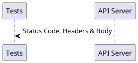

# Response Validation

Once a request is made, the server will send a response back. Validating the response will be the important part in API Testing.



Received response is validated through expectation methods. This library provides a rich set of methods to assert the response.

| Method (Chaining)         | Method (Breaking)       | Description                                 |
| ------------------------  | ----------------------- | ------------------------------------------- |
| `expect`                  | `_`                     | runs custom expect handler                  |
| `expectStatus`            | `status`                | check HTTP status                           |
| `expectHeader`            | `header`                | check HTTP header key + value               |
| `expectHeaderContains`    | `headerContains`        | check HTTP header key + partial value       |
| `expectBody`              | `body`                  | check exact match of body                   |
| `expectBodyContains`      | `bodyContains`          | check body contains the value               |
| `expectJson`              | `json`                  | check exact match of json                   |
| `expectJsonAt`            | `jsonAt`                | check json using **json-query**             |
| `expectJsonLike`          | `jsonLike`              | check loose match of json                   |
| `expectJsonLikeAt`        | `jsonLikeAt`            | check json like using **json-query**        |
| `expectJsonSchema`        | `jsonSchema`            | check json schema                           |
| `expectJsonSchemaAt`      | `jsonSchemaAt`          | check json schema using **json-query**      |
| `expectJsonMatch`         | `jsonMatch`             | check json to match                         |
| `expectJsonMatchAt`       | `jsonMatchAt`           | check json to match using **json-query**    |
| `expectJsonMatchStrict`   | `jsonMatchStrict`       | check json to strictly match                |
| `expectJsonMatchStrictAt` | `jsonMatchStrictAt`     | check json to strictly match at given path  |
| `expectJsonSnapshot`      | -                       | check json to match with a snapshot         |
| `expectResponseTime`      | `responseTimeLessThan`  | check response time                         |
| `expectError`             | `error`                 | check network errors                        |

# Expectations Style

Based on chosen [Testing Style](api-testing?id=testing-style), expectations methods are used.

<!-- tabs:start -->

#### ** Chaining **

In this approach, expectations methods are used along with request making methods.

```js
const pactum = require('pactum');

it('should have a user with name bolt', async () => {
  await pactum.spec()
    .get('http://localhost:9393/api/users')
    .withQueryParams('name', 'bolt')
    .expectStatus(200)
    .expectJson({
      "id": 1,
      "name": "bolt",
      "createdAt": "2020-08-19T14:26:44.169Z"
    })
    .expectJsonSchema({
      type: 'object',
      properties: {
        id: {
          type: 'number'
        }
      }
    })
    .expectResponseTime(100);
});
```

#### ** Breaking **

In this approach, request & expectations are made in multiple steps.

!> Regular expectation methods like `expectStatus` or `expectJson` will only work if called before the `toss` method.

```js
const pactum = require('pactum');

it('should have a user with name bolt', async () => {
  const spec = pactum.spec(); // don't use await
  spec.get('http://localhost:9393/api/users');
  spec.withQueryParams('name', 'bolt');
  // these expectations will work
  spec.expectStatus(200);
  spec.expectJson({
    "id": 1,
    "name": "bolt",
    "createdAt": "2020-08-19T14:26:44.169Z"
  });
  spec.expectJsonSchema({
    type: 'object',
    properties: {
      id: {
        type: 'number'
      }
    }
  });
  spec.expectResponseTime(100);
  // 'toss' method will make the request & runs the registered expectations
  await spec.toss();
  // these expectations will not work
  spec.expectHeader('content-type', 'application/json');
});
```

To run expectations after calling the `toss` method, we need to use either `spec.response()` or `pactum.expect`.

**pactum.expect**

```js
const pactum = require('pactum');

it('should have a user with name bolt', async () => {
  const spec = pactum.spec(); // don't use await
  spec.get('http://localhost:9393/api/users');
  spec.withQueryParams('name', 'bolt');
  // we need the response returned by toss() method
  const response = await spec.toss();
  pactum.expect(response).to.have.status(200);
  pactum.expect(response).to.have.header('connection', 'close');
});
```

**spec.response**

```js
const pactum = require('pactum');

it('should have a user with name bolt', async () => {
  const spec = pactum.spec(); // don't use await
  spec.get('http://localhost:9393/api/users');
  spec.withQueryParams('name', 'bolt');
  await spec.toss();
  spec.response().to.have.status(200);
  spec.response().to.have.header('connection', 'close');
});
```

<!-- tabs:end -->


# Expectations

## Status & Headers & Response Time

Expecting Status Code & Headers & response time from the response.

```js
it('get post with id 1', async () => {
  const response = await pactum.spec()
    .get('https://jsonplaceholder.typicode.com/posts/1')
    .expectStatus(200)
    .expectHeader('content-type', 'application/json; charset=utf-8')
    .expectHeader('connection', /\w+/)
    .expectHeaderContains('content-type', 'application/json')
    .expectResponseTime(100);
});
```

## expectJson

Performs deep equal.

```js
it('get post with id 1', async () => {
  const response = await pactum.spec()
    .get('https://jsonplaceholder.typicode.com/posts/1')
    .expectStatus(200)
    .expectJson({
      "userId": 1,
      "id": 1,
      "title": "some title",
      "body": "some body"
    });
});
```

## expectJsonAt

Allows validation of specific part in a JSON. See [json-query](https://www.npmjs.com/package/json-query) for more usage details.

* Performs deep equal or strict equal.
* Order of items in an array does matter.

```js
it('get people', async () => {
  await pactum.spec()
    .get('https://some-api/people')
    .expectStatus(200)
    .expectJson({
      people: [
        { name: 'Matt', country: 'NZ' },
        { name: 'Pete', country: 'AU' },
        { name: 'Mike', country: 'NZ' }
      ]
    })
    .expectJsonAt('people[country=NZ].name', 'Matt')
    .expectJsonAt('people[*].name', ['Matt', 'Pete', 'Mike']);
});
```

## expectJsonLike

Performs partial deep equal. 

* Allows Regular Expressions.
* Allows Assert Expressions.
* Allows Assert Handlers.
* Order of items in an array doesn't matter.

```js
it('posts should have a item with title -"some title"', async () => {
  await pactum.spec()
    .get('https://jsonplaceholder.typicode.com/posts')
    .expectStatus(200)
    .expectJsonLike([
      {
        "userId": /\d+/,
        "title": "some title"
      }
    ]);
});
```

### Assert Expressions

Assert Expressions helps to run custom JavaScript code on a JSON that performs user defined assertions. 

 * Expression should contain `$V` to represent current value.
 * Expression should be a valid JavaScript code.
 * Expression should return a *boolean*.

!> String containing **$V** will be automatically treated as a Assert Expression.

```js
it('get users', async () => {
  await pactum.spec()
    .get('/api/users')
    .expectJsonLike('$V.length === 10'); // api should return an array with length 10
    .expectJsonLike([
      {
        id: 'typeof $V === "string"',
        name: 'jon',
        age: '$V > 30' // age should be greater than 30 
      }
    ]);
});
```

You are also allowed to change the default value `$V` to some other string based on your usage. *Be cautious that all the strings containing the new value will be treated as assert expressions and pactum will try to evaluate it as a javascript code*.

```js
pactum.settings.setAssertExpressionStrategy({ includes: '$' });

it('get users', async () => {
  await pactum.spec()
    .get('/api/users')
    .expectJsonLike([
      {
        name: 'jon',
        age: '$ > 30' // age should be greater than 30 
      }
    ]);
});
```

### Assert Handlers

Assert Handlers helps us to reuse the custom JavaScript assertion code on a JSON. With this we can easily extend the capabilities of `expectJsonLike` to solve complex assertions.

 * Handler name will be prefixed with `#`.
 * Handler function should return a *boolean*.

!> String starting with **#** will be automatically treated as a Assert Handler. 

Handlers is a powerful concept in pactum that helps to reuse different things. To add a assert handler use `handler.addAssertHandler` function.

* First param will be the name of the assert handler which will be used in `expectJsonLike` to refer it.
* Second param will be a function that accepts a context object as an argument. Context object will have `data` property that will represent the current value in JSON. It also includes optional `args` property that includes custom arguments. 

```js
pactum.handler.addAssertHandler('number', (ctx) => {
  return typeof ctx.data === 'number';
});

it('get users', async () => {
  await pactum.spec()
    .get('/api/users')
    .expectJsonLike([
      {
        id: '#number',
        name: 'jon'
      }
    ]);
});
```

Custom arguments can be passed to the handler function by using comma separated values after `:`.

```js
pactum.handler.addAssertHandler('type', (ctx) => {
  return typeof ctx.data === ctx.args[0];
});

it('get users', async () => {
  await pactum.spec()
    .get('/api/users')
    .expectJsonLike([
      {
        id: '#type:number',
        name: 'jon'
      }
    ]);
});
```

You are also allowed to change the default value `#` to some other string based on your usage. *Be cautious that all the strings starting with the new value will be treated as assert handlers*.

```js
pactum.settings.setAssertHandlerStrategy({ starts: '#' });

it('get users', async () => {
  await pactum.spec()
    .get('/api/users')
    .expectJsonLike([
      {
        id: '#handlerName:arg1,arg2',
        name: 'jon'
      }
    ]);
});
```

## expectJsonLikeAt

Allows validation of specific part in a JSON. See [json-query](https://www.npmjs.com/package/json-query) for more usage details.

* Performs partial deep equal.
* Allows Regular Expressions.
* Allows Assert Expressions.
* Allows Assert Handlers.
* Order of items in an array doesn't matter.

```js
it('get people', async () => {
  await pactum.spec()
    .get('https://some-api/people')
    .expectStatus(200)
    .expectJson({
      people: [
        { name: 'Matt', country: 'NZ' },
        { name: 'Pete', country: 'AU' },
        { name: 'Mike', country: 'NZ' }
      ]
    })
    .expectJsonAt('people[*].name', ['Matt', 'Pete', 'Mike']);
    .expectJsonLikeAt('people[*].name', ['Mike', 'Matt']);
});
```

## expectJsonSchema

Allows validation of the schema of a JSON. See [json-schema](https://json-schema.org/learn/) for more usage details.

```js
it('get people', async () => {
  await pactum.spec()
    .get('https://some-api/people')
    .expectStatus(200)
    .expectJson({
      people: [
        { name: 'Matt', country: 'NZ' },
        { name: 'Pete', country: 'AU' },
        { name: 'Mike', country: 'NZ' }
      ]
    })
    .expectJsonSchema({
      "type": "object",
      "properties": {
        "people": {
          "type": "array"
        }
      }
    });
});
```

## expectJsonSchemaAt

Allows validation of the schema of a JSON at a specific place. See [json-schema](https://json-schema.org/learn/) for more usage details.

```js
it('get people', async () => {
  await pactum.spec()
    .get('https://some-api/people')
    .expectStatus(200)
    .expectJson({
      people: [
        { name: 'Matt', country: 'NZ' },
        { name: 'Pete', country: 'AU' },
        { name: 'Mike', country: 'NZ' }
      ]
    })
    .expectJsonSchemaAt('people', {
      "type": "array"
    });
});
```

## expectJsonMatch

Allows validation of JSON with a set of matchers. See [Matching](matching) for more usage details.

```js
const { like } = require('pactum-matchers');

it('get people', async () => {
  await pactum.spec()
    .get('https://some-api/people')
    .expectStatus(200)
    .expectJsonMatch({
      id: like(1),
      name: 'jon'
    });
});
```

## expectJsonMatchAt

Allows validation of specific part in a JSON with a set of matchers. See [Matching](matching) for more usage details. See [json-query](https://www.npmjs.com/package/json-query) for more usage details.

```js
const { like } = require('pactum-matchers');

it('get people', async () => {
  await pactum.spec()
    .get('https://some-api/people')
    .expectStatus(200)
    .expectJsonMatchAt('people[0]', {
      id: like(1),
      name: 'jon'
    });
});
```

## expectJsonSnapshot

Snapshot testing is a type of **output comparison** which will be very useful whenever we want to make sure our API does not change unexpectedly.

A typical snapshot test in pactum will fetch the api response, then compares it to a reference snapshot file stored alongside the test. The test will fail if the two snapshots do not match: either the change is unexpected, or the reference snapshot needs to be updated to the new version of the API response.

If you are running the test for the first time, pactum will save the api response body at `./pactum/snapshots` directory. For the next test runs, pactum will compare the actual response with the local reference file. 

A snapshot needs a name & it can be defined through `pactum.spec().name("<some name>")`.

!> It is mandatory to commit the snapshot files to the version control system. 

```js
it('get people', async () => {
  const response = await pactum.spec()
    .name('GET_People')
    .get('https://some-api/people')
    .expectStatus(200)
    .expectJsonSnapshot();
});
```

There are high chances that our server will return response containing dynamic data like `ids` or `dates`. Not to fail the snapshot at every run, pactum provides matchers for any property in the JSON. See [Matching](matching) for more usage details.

```js
const { like } = require('pactum-matchers');

it('get user mark', async () => {
  const response = await pactum.spec()
    .name('GET_User_Mark')
    .get('https://some-api/user/{username}')
    .withPathParams('username', 'Mark')
    .expectStatus(200)
    .expectJsonSnapshot({
      id: like(123)
    });
});
```

When there is an intentional change in the API response, our snapshot test fails because the snapshot for our updated API no longer matches the snapshot artifact for this test case. To resolve this, we will need to update our snapshot artifacts. Use `updateSnapshot` method in the test case & run the test to update the snapshot.

!> Remove `updateSnapshot` method from the test case after the snapshot is updated.

```js
const { like } = require('pactum-matchers');

it('get user mark', async () => {
  await pactum.spec()
    .name('GET_User_Mark')
    .get('https://some-api/user/{username}')
    .withPathParams('username', 'Mark')
    .expectStatus(200)
    .expectJsonSnapshot({
      id: like(123)
    })
    .updateSnapshot();
});
```

To change file location of snapshots, use `settings.setSnapshotDirectoryPath` method.

## expectError

Expect network errors.

```js
// expect any error
await pactum.spec().get(healthUrl).expectError();

// expect ECONNREFUSED error
await pactum.spec().get(healthUrl).expectError('ECONNREFUSED');

// expect error object
await pactum.spec().get(healthUrl).expectError({ code: 'ECONNREFUSED' });
```

# Response Settings

This library also offers us to set default expectations for all the responses received.

## setDefaultExpectHeaders

Sets the expected headers from all the HTTP responses.

```js
const pactum = require('pactum');
const { request, response } = pactum;

request.setBaseUrl('http://localhost:3000');
response.setDefaultExpectHeaders({ 'content-type': 'application/json'});

it('get projects', async () => {
  // request will be sent to http://localhost:3000/api/projects
  await pactum.spec()
    .get('/api/projects');
    // default expectations are applied
});
```

## setDefaultExpectResponseTime

Sets the default expected response time (in ms) for all the HTTP responses.

```js
pactum.response.setDefaultExpectResponseTime(500);
```

## setDefaultExpectStatus

Sets default expected HTTP status from HTTP responses.

```js
pactum.response.setDefaultExpectStatus(201);
```


## Custom Validations

By default, this library provides a rich set of assertion methods that mainly focuses on JSON content. We can also add custom expect handlers for making much more complicated assertions on different data types. You can bring your own assertion library or take advantage of popular libraries like [chai](https://www.npmjs.com/package/chai).

## AdHoc

You can simply pass a function as a parameter to `expect` & then write your logic that performs assertions. A *context* object is passed to the handler function which contains *req* (request) & *res* (response) objects.

```js
const expect = require('chai').expect;
const pactum = require('pactum');

it('post should have a item with title -"some title"', async () => {
  await pactum.spec()
    .get('https://jsonplaceholder.typicode.com/posts/5')
    .expect((ctx) => {
      const res = ctx.res;
      // run your custom assertions
    });
});
```

## Common

There might be a use case where you wanted to perform the same set of assertions. For such scenarios, you can add custom expect handlers that can be used at different places. A *context* object is passed to the handler function which contains *req* (request) & *res* (response) objects & *data* (custom data).

<!-- tabs:start -->

#### ** expect.handlers.js **

```js
const { addExpectHandler } = require('pactum').handler;
const { expect } = require('chai');

addExpectHandler('user details', (ctx) => {
  const res = ctx.res;
  const user = res.json;
  expect(user).deep.equals({ id: 1 });
});
```

#### ** base.spec.js **

```js
//  load handlers
require('./expect.handlers');
```

#### ** user.spec.js **

```js
const pactum = require('pactum');

it('should have user', async () => {
  const response = await pactum.spec()
    .get('/api/users/5')
    .expect('user details');

  // bdd style
  pactum.expect(response).should.have._('user details');
});
```

<!-- tabs:end -->

You are also allowed to pass custom data to common expect handlers.

<!-- tabs:start -->

#### ** expect.handlers.js **

```js
const { addExpectHandler } = require('pactum').handler;

addExpectHandler('user details', (ctx) => {
  const res = ctx.res;
  const req = ctx.req;
  const data = ctx.data;
  // add custom assertions
});
```

#### ** base.spec.js **

```js
//  load handlers
require('./expect.handlers');
```

#### ** user.spec.js **

```js
const pactum = require('pactum');

it('should have user', async () => {
  const response = await pactum.spec()
    .get('/api/users/5')
    .expect('user details', 5);
});
```

<!-- tabs:end -->

----

<a href="#/request-making" >
  
</a>
<a href="#/integration-testing" >
  
</a>